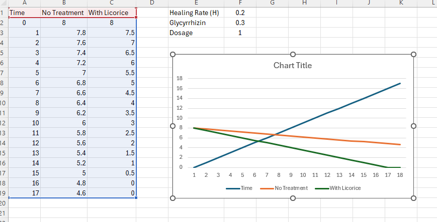
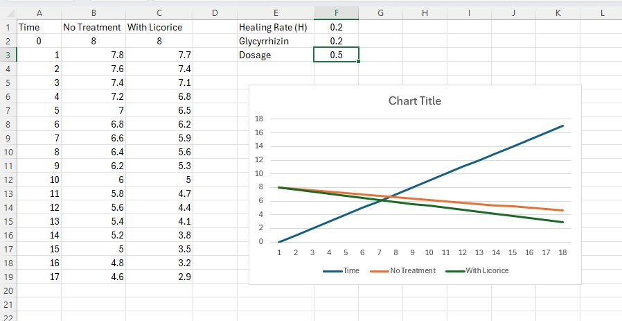
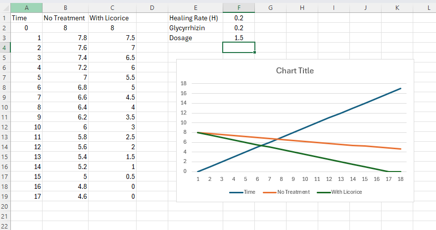

# Herbal-Cough-Simulation-Model-Licorice-Root-Study-
A simple Excel-based simulation that models cough recovery using natural healing and licorice root effects.
Compares treated vs untreated scenarios through adjustable variables and visual graphs.

# Overview
This project simulates how a cough improves over time using a virtual patient

## It compares:
- No treatment
- Licorice root treatment
- Built entirely using spreadsheet logic (no lab needed)
- The model includes the effect of Glycyrrhizin, a natural compound known for soothing and anti-inflammatory properties.

# Concept
- Cough severity is represented on a scale from 0 to 10
- Time progresses step-by-step (hours or days)
- The body heals naturally, and treatment accelerates recovery

# How It Works
- Without Treatment
bash```C(t+1) = C(t) - H```

- With Licorice
bash```C(t+1) = C(t) - H - (L × D)```

# Variables
- C(t) → Cough severity at time t
- H → Natural healing rate
- L → Licorice strength
- D → Dosage

# Implementation
## Built using:
Microsoft Excel

# Features
Adjustable variables (healing rate, dosage, strength)

## Two simulations:
- With treatment
- Without treatment
- Automatic calculations using formulas

# Graph visualization of results
- Screenshots
- Simulation Graph
- 




# How to Use
- Open the Excel file
- Modify the following values:
- Healing rate (H)
- Licorice strength (L)
- Dosage (D)
- Observe how the graph changes
- Compare recovery speed between both scenarios

# Experiment Ideas
- Test different dosages (low / medium / high)
- Simulate faster or slower healing rates
- Add randomness using:

# ⚠️ Disclaimer
This is a simulation model, not a medical experiment
Results are theoretical and simplified
Not intended for medical advice or real treatment. 

# Inspiration
This project shows how simple tools can be used to explore health ideas through digital simulation, making experimentation accessible without a lab.
